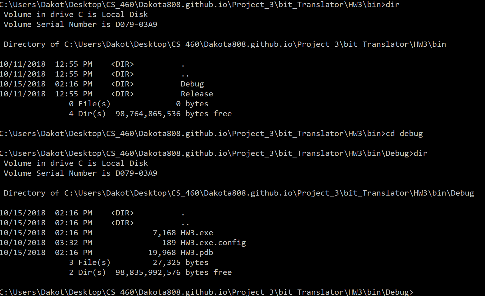
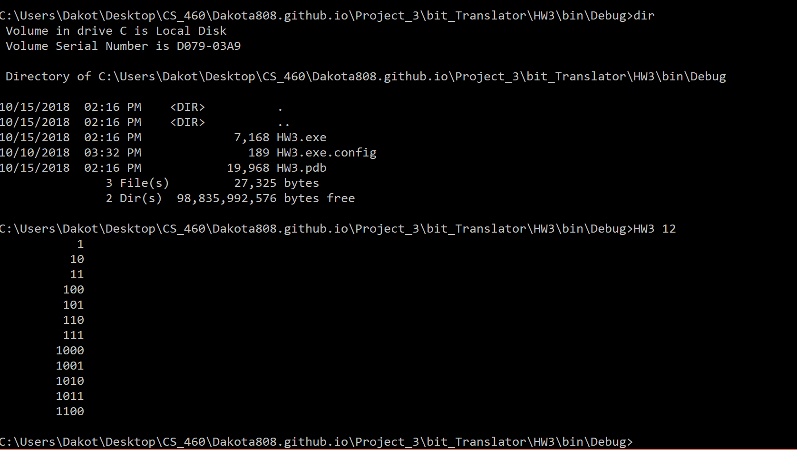
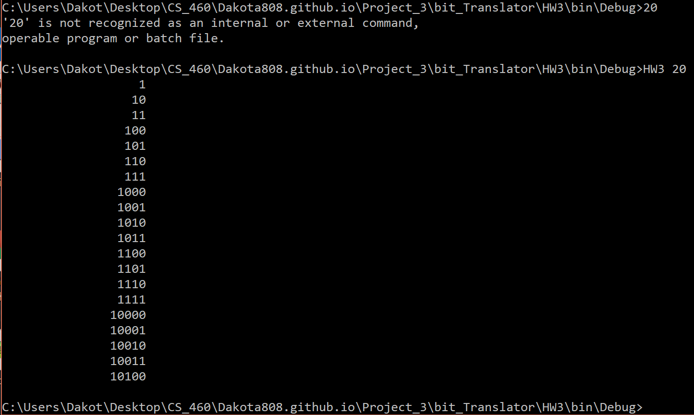

# Homework #3 <br>

## Learing C#
<p>
    So this assignment we are now getting into visual studio code. This application is more desgined for windows computers. So this was based for understanding of how to translate java code into (C#) C sharp code. The important note about these two coding languages are that they have simialr code functions. To see the differences between is type of calls that are issued for certain things such as Java's super class to the base class from C#. It can be translated in a similar way but one has to realize that the code translation between the two are simple to understand.   
</p>

Here are the links to the this assignment:<br>
[Repsoitory](https://github.com/Dakota808/Dakota808.github.io/tree/master/Project_3/bit_Translator/HW3)<br>
[Main Page](https://dakota808.github.io/)<br>

## Objective
We are to write C# code and be able to translate Java code as well. We were to refactor java code designed to make a binary tree which will take a input and interate through the process until they have met the input value so for example:<br>
```C#
             1
         /       \
        10       11
       /  \     /  \
     100  101 110  111
```
## Java To C#
This section we will be looking into the Java code and breif detail of how they function.<br>
Here's what we are looking into:<br>
```html
<ul>
    Node.java
    QueueInterface.java
    QueueUnderflowException.java
    LinkedQueue.java
    Main.java
</ul>
```
### Installing Visual Studio
<p>So installing the Visual studio code is not that hard however to setup the enviorment is know what you will need add on to work on certain things. For this case we need to run all functions of C# and web services such as MVC and ASPI. These can all be found when you first setup the Visual Studio which will ask you what types of features do you want to run.</p>
Setup is simple here's how:<br>
1.Download [Visual Studio](https://visualstudio.microsoft.com/downloads/)<br>
2.Add any feature you need to run<br>

<p>Once you have that setup you can start using Visual studio and if you need to add more tools go to you Tools tab in visual studios and click on "Get Tools and Features.</p>

### Node.java <br>
<p>
 The Node class from java is simple and easy to understand. But does (T) in the class header mean?Simple it intalizes the node pointer which will hold type.
</p>
<p>
So (T) is a class type which in this case can hold class type objects such as strings, integers, or object types. From this case we use the nodes as pointers to integers.
</p>

This will also introduce the use of "this" which indicate where we are in the list of nodes that we are in. 

### Java:
```Java
/** Singly linked node class. */

public class Node<T>
{
	public T data;
	public Node<T> next;
	
	public Node( T data, Node<T> next )
	{
		this.data = data;
		this.next = next;
	}
}
```
So translating this is simple and in fact they are exactly the same:
### C#
```C#
using System;
using System.Collections.Generic;
using System.Linq;
using System.Text;
using System.Threading.Tasks;

namespace HW3
{
    class Node<T>
    {
        /// <summary>
        /// This is in initalizing the the files data points in the nodes
        /// </summary>
        public T Data;
        public Node<T> Next;

        public Node(T data, Node<T> next)
        {
            ///This is the moving the pointer of the node 
            ///to the next node in the data.
            this.Data = data;
            this.Next = next;
        }
    }
}
```
Note: that in this display the code is in a what they call a namespace. This is the way visual studio is designed, it will hold all of the different class and it's functions inside a name space which C# uses the most and so you can consider the namspace as like a workbench or a folder which holds all of the work progress that you have done. 

### QueueUnderflowExecption

<p>When we look into how to handle exceptions in java is not the same as in C#. In fact one of the key things to note about them is that the excpeitons are handle outside of the class instead if a function just having to direct connection to the exception. So when I built the exception for this part I had no throw exceptions inside the body of the class or in the function. All of them were handle outside of this.</p>

### Java Code
```Java
/**
 * A custom unchecked exception to represent situations where 
 * an illegal operation was performed on an empty queue.
 */
public class QueueUnderflowException extends RuntimeException
{
  public QueueUnderflowException()
  {
    super();
  }

  public QueueUnderflowException(String message)
  {
    super(message);
  }
}

```


### C# Code
```C#
using System;
using System.Collections.Generic;
using System.Linq;
using System.Text;
using System.Threading.Tasks;

namespace HW3
{
    /// <summary>
    /// This is using the idea of running a test to check for 
    /// any operations that were executed/performed to a empty queue. 
    /// </summary>
    public class QueueUnderflowException : Exception
    {
        public QueueUnderflowException()
        {

        }
        /// <summary>
        /// This will return a string message that will 
        /// inform a illegal operation that is performed in the program.
        /// </summary>
        /// <param name="message"></param>
        public QueueUnderflowException(string message) : base(message)
        {


        }

    }
}


```
The only difference between Java and C# is where they handle the Exceptions. Java handles it inside the class for it. While C# handles it from the outside of the class using System which handles Exceptions and many other functions.<br>

### QueueInterface
There is no really significant difference between how java and C# use for functions. But how to declare the interface is different.Instead of running a QueueInterface like Java, C# uses an similar one called IQueueIterface. Honestly there really is not big difference between the two its just how they are defined in there respective language.<br>

### Java Code
```Java
/**
 * A FIFO queue interface.  This ADT is suitable for a singly
 * linked queue.
 */
public interface QueueInterface<T>
{
    /**
     * Add an element to the rear of the queue
     * 
     * @return the element that was enqueued
     */
    T push(T element);

    /**
     * Remove and return the front element.
     * 
     * @throws Thrown if the queue is empty
     */
    T pop() throws QueueUnderflowException;

    /**
     * Test if the queue is empty
     * 
     * @return true if the queue is empty; otherwise false
     */
    boolean isEmpty();
}

```

### C# Code
```C#
using System;
using System.Collections.Generic;
using System.Linq;
using System.Text;
using System.Threading.Tasks;

namespace HW3
{
    interface IQueueInterface<T>
    {
        /// <summary>
        /// This is holidng all the elements and then from there it will add
        /// the elements to the query. This will place that element to the end
        /// of the query.
        /// </summary>
        /// <param name="element"></param>
        /// <returns></returns>
        T Push(T element);

        /// <summary>
        /// This will take the top element from the top of the stack
        /// Then will then return that element.
        /// </summary>
        /// <returns></returns>
        T Pop();

        /// <summary>
        /// This is to check and see if the queue is empty.
        /// This will return false if the queue is populated,
        /// otherwise this will return true. 
        /// </summary>
        /// <returns></returns>
        bool IsEmpty();

    }
}
```
### LinkedQueue
The most important part to this particular part of this assignment is how to handle the null pointer exceptions. Which in C# reference is not the same as java's. The way they handle null pointers is by Null Reference Excepiton. The rest of the code is the similar to the Java code.

### Java Code
``` Java
public T push(T element)
	{ 
		if( element == null )
		{
			throw new NullPointerException();
		}
		
		if( isEmpty() )
		{
			Node<T> tmp = new Node<T>( element, null );
			rear = front = tmp;
		}
		else
		{		
			// General case
			Node<T> tmp = new Node<T>( element, null );
			rear.next = tmp;
			rear = tmp;
        }
        return element;
	}     
```
Push use the NullPointerException<br>

### C# Code
```C#
        /// <summary>
        /// This is where if a element type returning a null value it will throw a exception 
        /// which is similar to NullPointerException from java,
        /// This considered the NullReferenceException.
        /// </summary>
        /// <param name="element"></param>
        /// <returns></returns>
        public T Push(T element)
        {
            if (element == null)
            {
                throw new NullReferenceException();
            }

            if (IsEmpty())
            {
                Node<T> temp = new Node<T>(element, null);
                rear = front = temp;

            }
            else
            {
                Node<T> temp = new Node<T>(element, null);
                rear.Next = temp;
                rear = temp;
            }

            return element;
        }
```

<p>After you have done these four classes the code is basiclly runing the main as always but instead of ("System.out.println") we are using ("WriteLine") to print the result in the program.</p>

### Java Code
```Java
/**
 * Original by Sumit Ghosh "An Interesting Method to Generate Binary Numbers from 1 to n"
 * at https://www.geeksforgeeks.org/interesting-method-generate-binary-numbers-1-n/
 * 
 * Adapted for CS 460 HW3.  This simple example demonstrates the rather powerful
 * application of Breadth-First Search to enumeration of states problems.
 * 
 * There are easier ways to generate a list of binary values, but this technique
 * is very general and a good one to remember for other uses.
 */

import java.util.LinkedList; 

public class Main  
{ 
    /**
     * Print the binary representation of all numbers from 1 up to n.
     * This is accomplished by using a FIFO queue to perform a level 
     * order (i.e. BFS) traversal of a virtual binary tree that 
     * looks like this:
     *                 1
     *             /       \
     *            10       11
     *           /  \     /  \
     *         100  101  110  111
     *          etc.
     * and then storing each "value" in a list as it is "visited".
     */
    static LinkedList<String> generateBinaryRepresentationList(int n) 
    { 
        // Create an empty queue of strings with which to perform the traversal
        LinkedQueue<StringBuilder> q = new LinkedQueue<StringBuilder>(); 

        // A list for returning the binary values
        LinkedList<String> output = new LinkedList<String>();
        
        if(n < 1)
        {
            // binary representation of negative values is not supported
            // return an empty list
            return output;
        }
          
        // Enqueue the first binary number.  Use a dynamic string to avoid string concat
        q.push(new StringBuilder("1")); 
          
        // BFS 
        while(n-- > 0) 
        { 
            // print the front of queue 
            StringBuilder sb = q.pop(); 
            output.add(sb.toString()); 
            
            // Make a copy
            StringBuilder sbc = new StringBuilder(sb.toString());

            // Left child
            sb.append('0');
            q.push(sb);
            // Right child
            sbc.append('1');
            q.push(sbc); 
        }
        return output;
    } 
      
    // Driver program to test above function 
    public static void main(String[] args)  
    { 
        int n = 10;
        if(args.length < 1)
        {
            System.out.println("Please invoke with the max value to print binary up to, like this:");
            System.out.println("\tjava Main 12");
            return;
        }
        try 
        {
            n = Integer.parseInt(args[0]);
        } 
        catch (NumberFormatException e) 
        {
            System.out.println("I'm sorry, I can't understand the number: " + args[0]);
            return;
        }
        LinkedList<String> output = generateBinaryRepresentationList(n);
        // Print it right justified.  Longest string is the last one.
        // Print enough spaces to move it over the correct distance
        int maxLength = output.getLast().length();
        for(String s : output)
        {
            for(int i = 0; i < maxLength - s.length(); ++i)
            {
                System.out.print(" ");
            }
            System.out.println(s);
        }
    } 
} 

```
### C# Code
```C#
using System;
using System.Collections.Generic;
using System.Linq;
using System.Text;
using System.Threading.Tasks;


namespace HW3
{


    

        


        

     /// <summary>
     /// This will print the binary repesentation of all numbers from 1 up to n
     /// By doing this it will design a virtual binary tree that will perform
     /// a level order traversal using the FIFO queue. 
     /// Result should be like this:
     ///        1
     ///    /       \
     ///   10       11
     ///  /  \     /  \
     ///100  101 110  111
     ///
     /// etc.
     /// which will store each value that was visited in the list.
     /// </summary>
        public class MainRun
        {
            static LinkedList<string> generateBinaryRepList(int n)
            {
                ///Creates an empty queue of strings
                LinkedQueue<StringBuilder> x = new LinkedQueue<StringBuilder>();
                ///The list is returning the binary values
                LinkedList<string> output = new LinkedList<string>();

                if (n < 1)
                {
                    /// binary values and representation do not support negative values
                    /// return an empty list
                    return output;
                }

                ///This will add the first binary number. This uses a dynamic string
                ///to avoid string concat.
                x.Push(new StringBuilder("1"));

                ///BFS
                while(n > 0)
                {
                    ///print the first part of the queue
                    StringBuilder sb = x.Pop();
                    output.AddLast(sb.ToString());

                    ///Make a copy
                    StringBuilder sbc = new StringBuilder(sb.ToString());

                    ///Left Child
                    sb.Append("0");
                    x.Push(sb);
                    ///Right Child
                    sbc.Append("1");
                    x.Push(sbc);
                    n--;

                }
            return output;

            }
        /// <summary>
        /// This will be the driver and is testing the program.
        /// </summary>
        /// <param name="args"></param>
        static void Main(string[] args)
        {
            int n = 10;
            if (args.Length < 1)
            {
                Console.WriteLine("Please invoke with the max value to print binary up to, like this:");
                Console.WriteLine("\t Main 12");
                return;
            }
            try
            {
                n = Int32.Parse(args[0]);
            }
            catch (FormatException e)
            {
                Console.WriteLine("I'm sorry, I can not understand the input: " + args[0]);
            }

            LinkedList<string> output = generateBinaryRepList(n);

            int maxLength = output.Count();
            foreach (string s in output)
            {
                for (int i = 0; i < maxLength - s.Length; i++)
                {
                    Console.Write(" ");
                }
                Console.WriteLine(s);
            }
        }

    }


       

}


```
Here is a Demo of the running program





