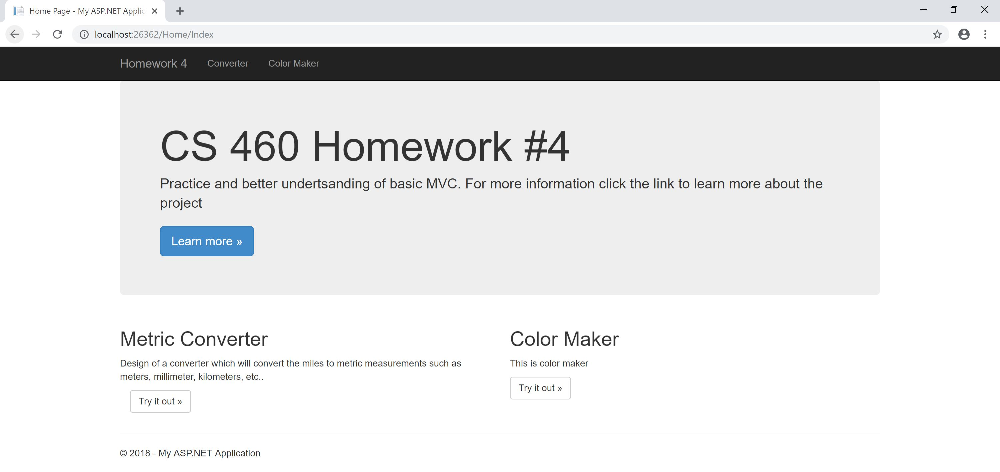
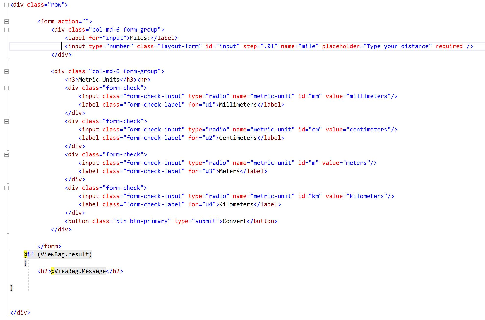
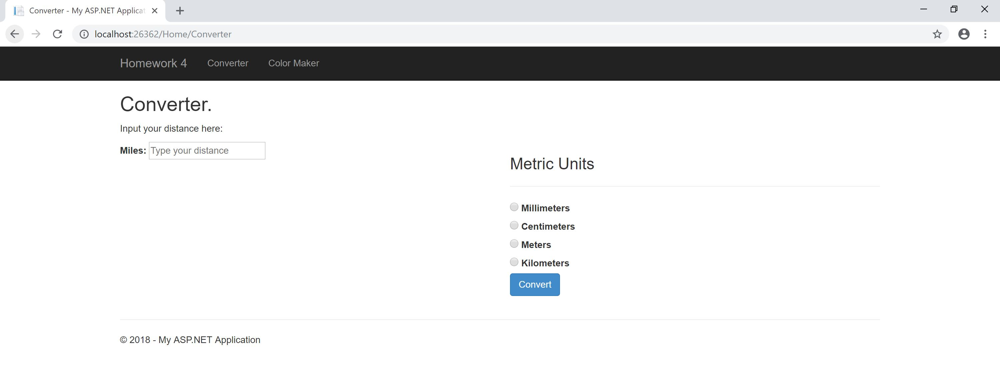
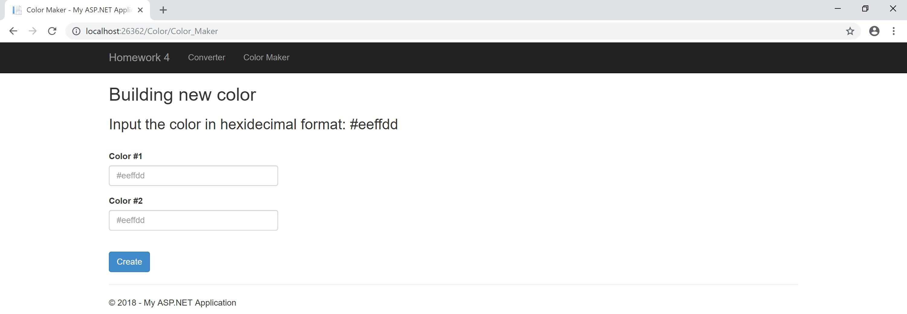
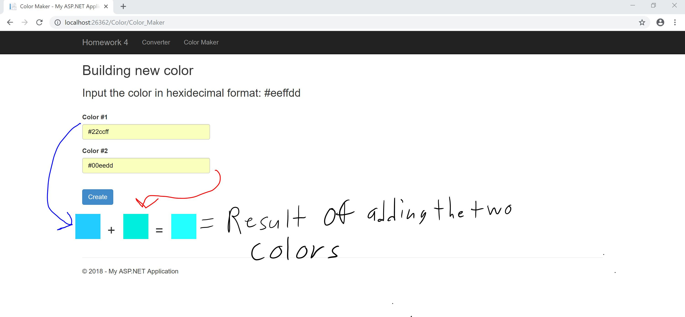

# Homework #4

## Building the web application

<p>
In this lab were designing the code to build two types of programs. First is the building a converter for miles, where we will convert miles into metric units such as: millimeters, centimeters, meters, kilometers. Then the second task is build a color maker which will create two colors and add the two colors together. However, the main thing to look at for these two fucntions is how we design the view for them as well the controllers for each of them. This is all done in visual studio.   
</p>

Here are the links to the this assignment:<br>
[Repository](https://github.com/Dakota808/Dakota808.github.io/tree/master/Project_4/HW4/HW4)<br>
[Main Page](https://dakota808.github.io/)<br>
Video Demo<br>
[Demo](https://youtu.be/xR0u45z3-3g)

### Metric unit Convertor

<p>First task is designing a metric unit converter for a string of integer. Which I did a switch case where each metric unit is running the code in that format. However, The main issuse came from the html page itself where I would get home twice which would crash the html page. So the way I fixed this was added the (/Home/Converter) Which will run the program correctly and this would not cause the double home. </p> 

```html

<div class="jumbotron">
    <h1>CS 460 Homework #4</h1>
    <p class="lead">Practice and better undertsanding  of basic MVC. For more information click the link to learn more about the project </p>
    <p><a href="http://www.wou.edu/~morses/classes/cs46x/assignments/HW4_1819.html" class="btn btn-primary btn-lg">Learn more &raquo;</a></p>
</div>

<div class="row">
    <div class="col-md-6">
        <h2>Metric Converter</h2>
        <p>
            Design of a converter which will convert the miles to metric measurements such as meters, millimeter, kilometers, etc..
        </p>
        <div class="col-md-6">
            
            <p><a class="btn btn-default" href="/Home/Converter">Try it out &raquo;</a></p>
        </div>
    </div>
    <div class="col-md-6">
        <h2>Color Maker</h2>
        <p>This is color maker</p>
        <p><a class="btn btn-default" href="/Color/Color_Maker">Try it out &raquo;</a></p>
    </div>

</div>
```
Here is a screenshot of the index page using razor links.<br>
<br>


<br>

<p>Then in convertor.cshtml file I desgined a text input for the distance you input, as well as the metric units that you will use to convert the distance such as millimeters, centimeters, etc.. The only thing to note is when I have user input the distances it will use a requried which makes the user have to put a value in the text field. Otherwise it will not continue. After that the code handles the input we use radio buttons which will connect to the controller that will execute the calculation/conversion of the input. It is a simple radio with a submit buttuon for this case. We also use the form to keep everything together in a groups.</p>

<br>
<br>

<p>After the we setup the html page for this we are now working in the Controllers which will do all of the calculation. so we use the [Httpget] which will allow the code to recevie the inputs from the html page which I built a simple switch case similar to a if else statement that returns the values of doubles which can handle large decimals and whole numbers. I also add a viewbag which will be false until we return the results for the calculation. We also design a simlpe debugger to print the lines into the file to make sure the file is receiving and returning the right inputs.</p>

```CS
 [HttpGet]
        public ActionResult Converter()
        {
            ViewBag.result = false;
            double miles = Convert.ToDouble(Request.QueryString["mile"]);
            string mearsurement = Request.QueryString["metric-unit"];
            Debug.WriteLine(miles);
            Debug.WriteLine(mearsurement);

            double result;
            switch (mearsurement)
            {
                case "millimeters":
                    result = miles * 1609344;
                    ViewBag.result = true;
                    break;
                case "centimeters":
                    result = miles * 160934.4;
                    ViewBag.result = true;
                    break;
                case "meters":
                    result = miles * 1609.344;
                    ViewBag.result = true;
                    break;
                case "kilometers":
                    result = miles * 1.609344;
                    ViewBag.result = true;
                    break;
                default:
                    result = -1;
                    break;
            }

            string message = "Conversion: " + Convert.ToString(result) + " "+ mearsurement;
            ViewBag.Message = message;


            return View();
        }
```

### Color Maker
<p>The color maker is similar to the converter and that we will use a excpetion handling method that will be discussed later. The design of the view for this is different from how I worked on the converter view. The setup is using razor and it will design the same as converter view and it will use a form but will use a lot of razor setups where we can call different forms as well as building the html inside of the razor. So we still use html but razor uses more function to do certain task such as the use of converting the input string into hexdecimal which is the pattern of the result that we will send to the Colorcontorller. </p> <br>

<br>

<p>This then uses the cod and we use the debugger to check and see if the program is receving the input values that the user submits and the formula to convert those inputs into what visual studio color which is used to convert it into the colors. However, the main issue is when we need to add the colors together. Calculations will go over the spectrum of the limit of the color which is 255 for each type from ARBG. So I built the if else statement for each one which will calculate the two colors and return the result. However if the color goes beyond 255 then we will initialize the code to set the value to 255 an when that happens that is the default color which is white. </p><br>

```CS
[HttpGet]
        public ActionResult Color_Maker()
        {
            ViewBag.show = false;
            return View();
        }

        [HttpPost]
        public ActionResult Color_Maker(string ColorOne, string ColorTwo)
        {

            //debug print on strings
            ColorOne = Request.Form["Color1"];
            ColorTwo = Request.Form["Color2"];
            Debug.WriteLine(ColorOne);
            Debug.WriteLine(ColorTwo);
            //error checking for values of objects
            int color_A;
            int color_R;
            int color_B;
            int color_G;
            //convert strings to color objects
            Color rgb_c1 = ColorTranslator.FromHtml(ColorOne);
            Color rgb_c2 = ColorTranslator.FromHtml(ColorTwo);

            //mix values of color objects w/ err checking
            
            //This is for the bits of the hexadecimal which is color A

            if (rgb_c1.A + rgb_c2.A >= 255)
            {
                color_A = 255;
            }
            else
            {
                color_A = rgb_c1.A + rgb_c2.A;
            }

            if (rgb_c1.R + rgb_c2.R >= 255)
            {
                color_R = 255;
            }
            else
            {
                color_R = rgb_c1.R + rgb_c2.R;
            }

            if (rgb_c1.B + rgb_c2.B >= 255)
            {
                color_B = 255;
            }
            else
            {
                color_B = rgb_c1.B + rgb_c2.B;
            }

            if (rgb_c1.G + rgb_c2.G >= 255)
            {
                color_G = 255;
            }
            else
            {
                color_G = rgb_c1.G + rgb_c2.G;
            }


            //make mixed color object with values
            string mixColor = ColorTranslator.ToHtml(Color.FromArgb(color_A, color_R, color_B, color_G));
            //convert all color objects to html objects
            if( ColorOne != null && ColorTwo != null)
            {
                ViewBag.show = true;

                ViewBag.shape = "width:55px; height:55px; border: 1px soild #000; background:" + ColorOne + ";";
                ViewBag.shape1 = "width:55px; height:55px; border: 1px soild #000; background:" + ColorTwo + ";";
                ViewBag.shape2 = "width:55px; height:55px; border: 1px soild #000; background:" + mixColor + ";";

            }


            return View();

        }
```

The viewbag.shape is just building the color of the setup around the what colors we print out and then in the view it is then desinged inside of the view to display the end result of the colors. <br>

<br>

<p>
This gives a clear set of understanding of how the get and post are used to create the color and display the color mix from this case of the program. However the function of the prgram is the more key thing to look at where we use a lot of different systems from visual studio to run the program such as "system.drawing" which creates the colors and uses a color translator function to covert string into color. As well as how we can develop different types of functions to execute the same command example from a switch case instead of a if else statement. 
</p>
 
The end result is a program that runs to different functions but similar in design and the use of all of the differnet systems and programs that can be run in visual studio. The use of controllers to run the functions and debuging of code and uses of both razor and html in views.<br>

### Merge Conflict 
<p>Merge conlfict is something most people want to avoid when working with other people. For that code could be different with what others causing major problems in a project. To fix this it is best to pull to the current branch that your are working on to make sure that no issues come from the code itself. So I had built the 4.1 which is the converter and 4.2 which is the color maker. Both of these branches branch off of the master. However, I pulled all of my work from 4.1 to 4.2 to make sure the program was running properly and in then merged 4.2 to master. However, I ran into issue of the merge conflict when merging because of modification in the master which was my blog for homework three which I did in visual studio code which I fixed the merge issue from there and after that was settled the merge of 4.2 was successful. </p>
