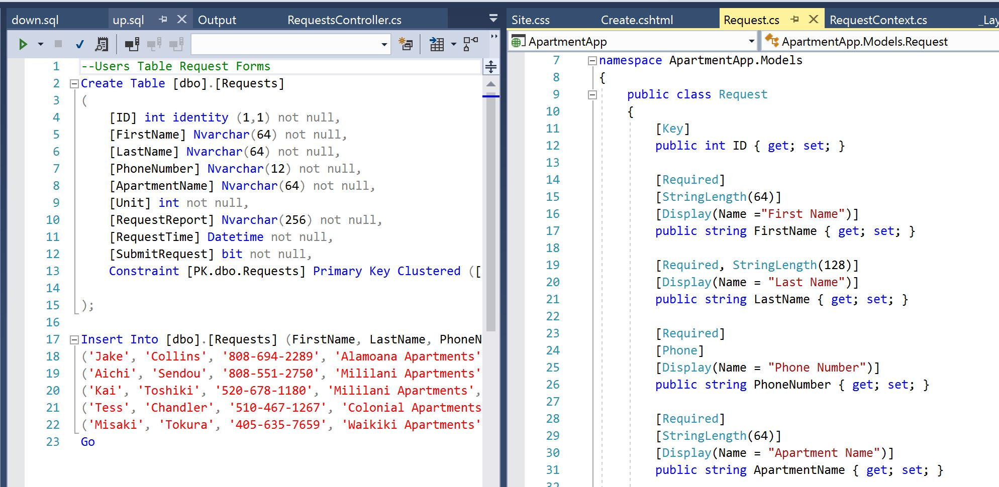

# Homework #5

## Web application using single database

<p>
This is assignment is in consider a simple basic web application development design using only a single table to create a database. Most people would only think this is simple when I was working on this assignment I had to deal with multiple different issue that weren't related to the assignment. Which in the real world that will happen. 
</p>

<p>
So in this assignment we create the database using sql which visual studio builds a our own (.mdf) which are located in the APP_DATA. From there we build two queries that are designed to do two import task in the database. First is the (up.sql) where we build the tables that holds our data to display inside our web application. After that we have the  down.sql which is used to drop our tables while we are testing to make sure that the database is working. 
</p>

Links to assignment:
[Main Page](https://dakota808.github.io/)<br>
[Repository](https://github.com/Dakota808/Dakota808.github.io/tree/master/Project_5.2/ApartmentApp/ApartmentApp)<br>
[Demo]<br>

<p>
This program assignment is difficult due to some difficult problems that occur for no reason sometimes. One example is when the program runs and bin file does not responed to cleaning or rebuilding of the solution. This is how ever the code is simple to understand how it functions. 
</p>

### Model desgin

<p>The model desgin is simple we build the table in the (mdf) file and then design the code from the model which has to match the table values exactly. This being the main issue I had to deal with make sure the names match with each other. From the there the code gets more interesting where make the values in the view required from the model file itself. But that will only help display and help with the input of the values. </p>

```CS
using System;
using System.Collections.Generic;
using System.Linq;
using System.Web;
using System.ComponentModel.DataAnnotations;

namespace ApartmentApp.Models
{
    public class Request
    {
        [Key]
        public int ID { get; set; }

        [Required]
        [StringLength(64)] 
        [Display(Name ="First Name")]
        public string FirstName { get; set; }

        [Required, StringLength(128)]
        [Display(Name = "Last Name")]
        public string LastName { get; set; }

        [Required]
        [Phone]
        [Display(Name = "Phone Number")]
        public string PhoneNumber { get; set; }

        [Required]
        [StringLength(64)]
        [Display(Name = "Apartment Name")]
        public string ApartmentName { get; set; }

        [Required]
        [Range(int.MinValue, int.MaxValue)]
        [Display(Name = "Apartment Unit")]
        public int Unit { get; set; }

        [Required]
        [StringLength(256)]
        [Display(Name = "Request")]
        public string RequestReport { get; set; }

        [Required]
        [Display(Name ="Date of  Request")]
        public DateTime RequestTime { get; set; }

        [Required]
        [Display(Name ="Submitted") ]
        public bool SubmitRequest { get; set; }

        public override string ToString()
        {
            return $"{base.ToString()}: First Name = {FirstName} Last Name = {LastName} Phone Number = {PhoneNumber} Apartment = {ApartmentName} Unit = {Unit} Request = {RequestReport} Submission ={RequestTime} Submitted = {SubmitRequest}";
        }
    }
}
```

```sql
--Users Table Request Forms
Create Table [dbo].[Requests]
(
	[ID] int identity (1,1) not null,
	[FirstName] Nvarchar(64) not null,
	[LastName] Nvarchar(64) not null,
	[PhoneNumber] Nvarchar(12) not null,
	[ApartmentName] Nvarchar(64) not null,
	[Unit] int not null,
	[RequestReport] Nvarchar(256) not null,
	[RequestTime] Datetime not null,
	[SubmitRequest] bit not null,
	Constraint [PK.dbo.Requests] Primary Key Clustered ([ID] ASC)

);

Insert Into [dbo].[Requests] (FirstName, LastName, PhoneNumber, ApartmentName, Unit, RequestReport, RequestTime, SubmitRequest) Values
('Jake', 'Collins', '808-694-2289', 'Alamoana Apartments', 302, 'Need to have someone check our smoke deterctors are functioning', '2018-08-24', 0),
('Aichi', 'Sendou', '808-551-2750', 'Mililani Apartments', 442, 'Requesting for cleaners to come in and clean for my new roommate', '2018-09-18', 1),
('Kai', 'Toshiki', '520-678-1180', 'Mililani Apartments', 442, 'Moving into the apartment on september 30th, 2018', '2018-09-18', 1),
('Tess', 'Chandler', '510-467-1267', 'Colonial Apartments', 102, 'Need the floors replaced in the apartment.', '2018-10-21', 1),
('Misaki', 'Tokura', '405-635-7659', 'Waikiki Apartments', 202, 'Bathroom pluming fixture, and replace shower head', '2018-11-04', 0)
Go
```

<br>

<p>
These two files must hold the same values as one another. Otherwise they will not display the proper tables that you wanted to display in the view.
</p>

### Controller Design

<p>
The controller desgin is more difficult to understand. We can make this more simple thanks to visual studio where we will just scaffold the model and database to build a controller for those files and which will also build a view for it as well. But something we always do is get a get and post to pull and send our information to and from our view. However, we also introduce the use of entity framework which will require us to know the more about in our next assignment. 
</p>

```CS
using System.Data.Entity;
using System.Linq;
using System.Net;
using System.Web;
using System.Web.Mvc;
using ApartmentApp.DAL;
using ApartmentApp.Models;

namespace ApartmentApp.Controllers
{
    public class RequestsController : Controller
    {
        private RequestContext db = new RequestContext();

        // GET: Requests
        public ActionResult Index()
        {
            return View(db.Requests.ToList());
        }

        // GET: Requests/Details/5
        public ActionResult Details(int? id)
        {
            if (id == null)
            {
                return new HttpStatusCodeResult(HttpStatusCode.BadRequest);
            }
            Request request = db.Requests.Find(id);
            if (request == null)
            {
                return HttpNotFound();
            }
            return View(request);
        }

        // GET: Requests/Create
        public ActionResult Create()
        {
            return View();
        }

        // POST: Requests/Create
        // To protect from overposting attacks, please enable the specific properties you want to bind to, for 
        // more details see https://go.microsoft.com/fwlink/?LinkId=317598.
        [HttpPost]
        //[ValidateAntiForgeryToken]
        public ActionResult Create([Bind(Include = "ID,FirstName,LastName,PhoneNumber,ApartmentName,Unit,RequestReport,RequestTime,SubmitRequest")] Request request)
        {
            if (ModelState.IsValid)
            {
                db.Requests.Add(request);
                db.SaveChanges();
                return RedirectToAction("Index");
            }

            return View(request);
        }

        // GET: Requests/Edit/5
        public ActionResult Edit(int? id)
        {
            if (id == null)
            {
                return new HttpStatusCodeResult(HttpStatusCode.BadRequest);
            }
            Request request = db.Requests.Find(id);
            if (request == null)
            {
                return HttpNotFound();
            }
            return View(request);
        }

        // POST: Requests/Edit/5
        // To protect from overposting attacks, please enable the specific properties you want to bind to, for 
        // more details see https://go.microsoft.com/fwlink/?LinkId=317598.
        [HttpPost]
        //[ValidateAntiForgeryToken]
        public ActionResult Edit([Bind(Include = "ID,FirstName,LastName,PhoneNumber,ApartmentName,Unit,RequestReport,RequestTime,SubmitRequest")] Request request)
        {
            if (ModelState.IsValid)
            {
                db.Entry(request).State = EntityState.Modified;
                db.SaveChanges();
                return RedirectToAction("Index");
            }
            return View(request);
        }

        // GET: Requests/Delete/5
        public ActionResult Delete(int? id)
        {
            if (id == null)
            {
                return new HttpStatusCodeResult(HttpStatusCode.BadRequest);
            }
            Request request = db.Requests.Find(id);
            if (request == null)
            {
                return HttpNotFound();
            }
            return View(request);
        }

        // POST: Requests/Delete/5
        [HttpPost, ActionName("Delete")]
        //[ValidateAntiForgeryToken]
        public ActionResult DeleteConfirmed(int id)
        {
            Request request = db.Requests.Find(id);
            db.Requests.Remove(request);
            db.SaveChanges();
            return RedirectToAction("Index");
        }

        protected override void Dispose(bool disposing)
        {
            if (disposing)
            {
                db.Dispose();
            }
            base.Dispose(disposing);
        }
    }
}

```