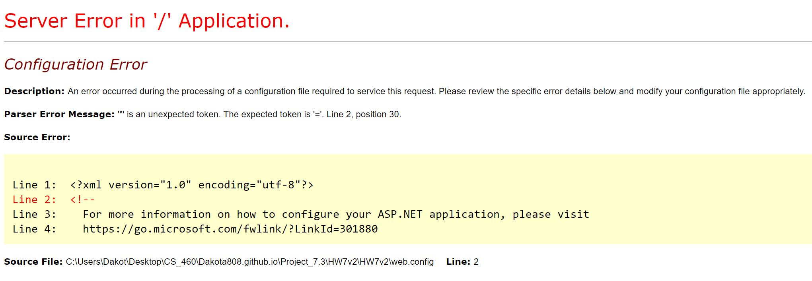

# Homework #7 
<br>
## Ajax application
<br>

<p>
In this assignment we were to build a api application using ajax and connect the web service of giphy to send us stickers that would display each time we have a space between the strings inside of a text box field. This assignment is a simple design for the most part however, there were some unforseen issue that occured in my code. Even now I am still trying to figure out why the error still occurs when all data is correct and there are no issue the connection strings or the code that I built.  
</p>

Links to assignment:<br>
[Repository](https://github.com/Dakota808/Dakota808.github.io/tree/master/Project_7.3/HW7v2/HW7v2)<br>
[Main Page](https://dakota808.github.io/)<br>

### Javascript 
<p>
In this assignment we had to build our own javascript which would only handle the action listening to the users input inside of the text box field to send back a display. So in script file I would also build a list that would hold certain words that I would make giphy disreguard them and send them back string inputs and would continue to do this for all lines of code in the assignment.
</p>

```javascript
var boringWords = ["", "the", "to", "and", "of", "that", "have", "from", "by", "save","was", "has", "am", "over", "up", "down", "too", "who", "get", "always", "his", "hers", "by", "from", "they", "so", "up", "out", "if", "about", "who", "get", "which", "go", "me", "public", "are",
    "make", "can", "like", "time", "no", "just", "know", "take", "people", "into", "year", "your", "good", "some", "could", "always", "went",
    "them", "see", "other", "than", "then", "now", "look", "only", "come", "its", "it's", "over", "think", "also", "back", "really", "store",
    "after", "use", "two", "how", "our", "work", "first", "well", "way", "even", "new", "want", "because", "any", "these", "give", "every",
    "day", "most", "us", "my", "mine", "yours", "they're", "I'm", "going", "took", "huge", "big", "large", "very", "am", "let's", "had",
    "try", "wicked", "pretty", "is", "please", "was", "name", "named", "stay", "away", "any", "anymore", "we're", "brought", "does", "did"
];


function userInput() {


    return $("#userInput").val().length;
}


function isKeyword(keyWord)
{
    var temp = keyWord;

    var isKeyword = true;
    for (var i = 0; i < boringWords.length; i++)
    {
        if (boringWords[i].toLowerCase() === temp.toLowerCase())
        {
            isKeyword = false;
        }
    }
    return isKeyword;
}

function displayGif(result)
{
    var giphyUrl = result.data.images.preview_git.url;

    console.log(giphyUrl);
    $("#message").append("");

}

function insertWord(keyWord)
{

    $("#messageContainer").append(" " + "<label> " + keyWord + " </label>");
}

function getKeywordTyped()
{
    var KeyWord = "";

    var input = document.getElementById("userInput").value;

    var parsedInput = input.substr(0, input.length).replace(/[.,\/#!$%^&\*;:{}=\-_`~()]/g, "");

    if (/\S/.test(parsedInput))
    {
        keyWord = parsedInput.split(" ").pop();

    }

    return keyWord;
}

function actionChoice(keyWord)
{
    if (isKeyword(keyWord))
    {
        $.ajax(
            {
                datatype: "json",
                url: "/Request/GiphyTranslator?=",
                data: { "keyWord": keyWord },
                success: insertWord
            });

    }
    else
    {
        insertWord(keyWord);

    }

    function main()
    {
        $("#userInput").focus();

        $("#userInput").keypress(function ()
        {
            
            if ($("#userInput").val().length > 0 && event.which === 32)
            {
                var keyWord = getKeywordTyped();

                actionChoice(keyWord);

                $("#userInput").focus();
            }

        });


    }
}

$(document).ready(main);
```
<br>

### Adding the route configurations
<p>
The configuration of this project was also something we had to handle so in this case we have to moddify the route config to make sure that the application also listens to the two controllers that I used in this particular assignment. One of is for main view page and the other is using the path and connection for the second controller which handles the api connection between the two contorllers.
</p>

### Routing config
```CS
using System;
using System.Collections.Generic;
using System.Linq;
using System.Web;
using System.Web.Mvc;
using System.Web.Routing;

namespace HW7v2
{
    public class RouteConfig
    {
        public static void RegisterRoutes(RouteCollection routes)
        {
            routes.IgnoreRoute("{resource}.axd/{*pathInfo}");

            routes.MapRoute(
                name: "Default",
                url: "{controller}/{action}/{id}",
                defaults: new { controller = "Home", action = "Index", id = UrlParameter.Optional }
            );

            routes.MapRoute(
                name: "GiphyTranslator",
                url: "{controller}/{action}/{keyWord}",
                defaults: new { controller = "Request", action = "GiphyTranslator", keyWord = UrlParameter.Optional }
            );
        }
    }
}
```

### Home contoller: Handles the main view page for the application
```CS
using System;
using System.Collections.Generic;
using System.Web;
using System.Dynamic;
using System.Web.Mvc;

namespace HW7v2.Controllers
{
    public class HomeController : Controller
    {
        // GET: Main page
        [HttpGet]
        public ActionResult Index()
        {
            return View();
        }
    }
}
```

### Giphy Controller
```CS
using System;
using System.Collections.Generic;
using System.Web;
using System.Dynamic;
using System.IO;
using System.Net;
using System.Web.Mvc;
using HW7v2.DAL;
using HW7v2.Models;

namespace HW7v2.Controllers
{
    public class GiphyController : Controller
    {
        private SearchLogContext requestLog = new SearchLogContext();
        // GET: Giphy
        [HttpGet]
        public JsonResult GiphyTranslator(string keyWord)
        {
            string secretKey = System.Web.Configuration.WebConfigurationManager.AppSettings["gif"];
            
            string giphyUrl = "http://api.giphy.com/v1/stickers/translate?api_key=" + secretKey + "&s=" + keyWord;

            WebRequest sendRequest = WebRequest.Create(giphyUrl);

            WebResponse getResponse = sendRequest.GetResponse();

            Stream data = sendRequest.GetResponse().GetResponseStream();

            string convertResponse = new StreamReader(data).ReadToEnd();

            var serialize = new System.Web.Script.Serialization.JavaScriptSerializer();

            var jsonResponse = serialize.DeserializeObject(convertResponse);

            SearchLog requestLogDB = requestLog.SearchLogs.Create();

            requestLogDB.RequestTimestamp = DateTime.Now;

            requestLogDB.RequestType = Request.Url.OriginalString;

            requestLogDB.ClientIP = Request.UserHostAddress;

            requestLogDB.BrowserSearch = Request.Browser.Type;

            requestLog.SearchLogs.Add(requestLogDB);
            requestLog.SaveChanges();


            data.Close();
            getResponse.Close();
            return Json(jsonResponse, JsonRequestBehavior.AllowGet);
        }


    }
}
```

We also had to make a giphy account on the website and then connect that string inside of the connection Strings form in the Web.config file. This is so that we can connect to the giphy site and add the app connections.<br>

```config
<appSettings>
    <add key="GiphyKey" value"PAhFuy0fIA6AIm7lSPNFoA1iDfzMm5zQ"

</appSettings>
```
<br>
```html
<appSettings file="../../../../gif.config">
    <add key="webpages:Version" value="3.0.0.0" />
    <add key="webpages:Enabled" value="false" />
    <add key="ClientValidationEnabled" value="true" />
    <add key="UnobtrusiveJavaScriptEnabled" value="true" />
  </appSettings>
```
<br>

The only thing to make sure the view has the specific layout to send string inputs to the giphy site and return them back to the view and display the text in an area for us to have a look at.<br> 

```html
@{
    ViewBag.Title = "Index";
}

<div class="row">

    <div style="width: 100%; margin: 0 auto;">
        <div>
            @Html.TextBox("inputs", "",
           new
           {
               @class = "form-control",
               id = "stringInputs",
               placeholder = "Type your message here",
               type = "text"
           })

            <input type="button" id="clear" value="Restart" onclick="window.location.reload()" />
        </div>
    </div>
</div>

<div style="margin-top: 20px;"></div>

<div id="container" style="margin-left: 15px;">
    <p>
        <div id="message"></div>
    </p>


    @section scriptSection
    {

        <script type="text/javascript" src="~/Scripts/giphy_functions.js"></script>

    }
</div>

<footer>
    <hr />
    <p>&copy; @DateTime.Now.Year - Dakota Koki</p>
</footer>
```
One of the most weirdist issue that I encountered and still trying to figure out is the code is correct and the all of the references are correct as well but the app is saying that something is missing still and we know that it is located in there and then this issue puzzled me and many others trying to understand why this is happening. <br>


<br>

